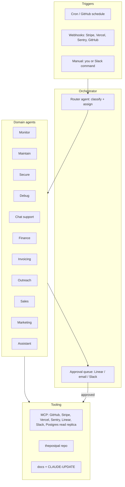

# Posterboy agent fleet plan

**Date:** 2026-05-18  
**Audience:** Brad + engineering / ops collaborators  
**Scope:** Operational agents for Posterboy Social (product + business), not customer-facing “AI employees” inside the app (those are a separate layer).

This plan defines **what agents to build**, **how they run**, **what they can touch**, and **in what order**—for monitoring, maintenance, security, debugging, support, finance, invoicing, outreach, sales, marketing, and general assistance.

---

## 1. What we mean by “agent”

Three layers—use all three; don’t collapse them into one blob.

| Layer | Runtime | Best for | Examples |
|-------|---------|----------|----------|
| **A. IDE skills & subagents** | Cursor (you + chat) | Deep code work, PR babysit, one-off investigations | `babysit`, `ci-investigator`, custom `SKILL.md` per domain |
| **B. Scheduled / event agents** | Cursor SDK, GitHub Actions, cron + webhooks | Repeatable checks, nightly reports, on-alert triage | Cloud agent on `main`, local agent on feature branch |
| **C. Product agents** | In-app (`/api/ai`, onboarding agent) | End-user value inside Posterboy | Brand book wizard, caption assistant, “what to post” |

**This document focuses on Layer B (ops/business fleet) and the skills that power Layer A.** Layer C already exists partially; it should **read tenant brand book + RLS context**, not duplicate ops agents.

---

## 2. Design principles

1. **Human-in-the-loop by default** for money, legal, outbound email, production deploys, and credential rotation.
2. **Read-only first**—every new agent ships as observer → recommender → actor (with approval).
3. **Single source of truth per domain**—avoid two agents writing the same system (e.g. Stripe + manual spreadsheet).
4. **Tenant isolation**—product-facing agents never cross `organizationId`; ops agents use **admin** tools only on Brad-owned infra accounts.
5. **Cost caps**—each scheduled agent has max runs/day, max tokens, and “fail closed” (alert Brad, don’t spam retries).
6. **Audit trail**—every action logs: who triggered, inputs, output summary, links (PR, invoice id, ticket id).

### Autonomy tiers

| Tier | Name | Can do |
|------|------|--------|
| **0** | Observe | Read metrics/logs/docs; post summary to Slack/email |
| **1** | Recommend | Open draft PR, draft email, draft invoice line items—no send/charge/merge |
| **2** | Act (sandbox) | Fix on branch, run tests, update staging |
| **3** | Act (prod)** | Merge, deploy, charge card, send email—**requires explicit approval queue** |

Most fleet agents stay **0–1** until beta stabilizes; **maintain** and **debug** can reach **2** on non-prod; **secure** never auto-patches prod without review.

---

## 3. Fleet architecture



**Router agent (thin):** One lightweight scheduled job reads alerts + inbox + failed CI and assigns a **single owner agent** per item. Prevents five agents all “fixing” the same Stripe webhook failure.

---

## 4. Agent catalog

Each row: **purpose**, **triggers**, **tools**, **autonomy**, **MVP deliverable**, **phase**.

### 4.1 Monitor

**Purpose:** Know when the product or business is unhealthy before customers do.

| Signal | Source | Action |
|--------|--------|--------|
| Site down / 5xx | Vercel, Better Uptime | Page Brad; open `ci-investigator`-style summary |
| API error rate | Sentry / Vercel logs | Daily digest + spike alert |
| Stripe webhook failures | Stripe Dashboard + `/api/webhooks/stripe` logs | Alert + link to event id |
| Meta token expiry | DB `SocialConnection` + publish failures | Per-tenant “reconnect” list |
| DB migration drift | CI `prisma migrate` | Block merge recommendation |
| Beta cohort health | `GET /api/me`, signup funnel, active locations | Weekly table: Solo vs Command counts |

**Triggers:** Every 15 min (critical), daily 7am CT (digest).  
**Tools:** Vercel MCP/API, Sentry, Stripe read-only, Postgres read-only (no PII export in logs).  
**Autonomy:** Tier 0–1.  
**MVP:** Slack/email digest: deploy status, open Sentry issues, webhook failures, demo login smoke (`8240` or prod URL).  
**Phase:** **P0** (week 1).

---

### 4.2 Maintain

**Purpose:** Keep repo, dependencies, and infra boring—merge-ready PRs, doc drift fixes, schema hygiene.

| Task | Frequency |
|------|-----------|
| Dependency audit (`npm audit`, minor bumps) | Weekly |
| `tsc` + `build` on `main` | On every push |
| Prisma schema vs migrations check | On PR |
| Stale branch cleanup | Monthly |
| CLAUDE-UPDATE / handoff freshness | After each sprint |
| RLS policy regression scan | Monthly |

**Triggers:** GitHub PR opened, nightly on `main`, manual “run maintain”.  
**Tools:** GitHub, local/cloud Cursor SDK on repo, existing `babysit` skill.  
**Autonomy:** Tier 1–2 (open PR); Tier 3 only for patch deps with green CI.  
**MVP:** Scheduled GitHub Action + SDK agent: `tsc`, `build`, comment PR summary.  
**Phase:** **P0** (already partially covered by `babysit`; formalize).

---

### 4.3 Secure

**Purpose:** Reduce breach and compliance risk for multi-tenant SaaS.

| Check | Notes |
|-------|--------|
| Secret scanning (repo + env templates) | No keys in commits |
| Middleware / auth route coverage | Webhooks exempt list stays minimal |
| RLS: cross-tenant read tests | Scripted queries as two tenants |
| OAuth scope review (Meta) | Least privilege |
| Rate limits on AI/upload endpoints | Already partial—verify |
| Dependency CVEs | Critical → same day ticket |
| Access review | Who has prod DB, Stripe, Vercel |

**Triggers:** Weekly scan; on dependency PR; before prod promote.  
**Tools:** GitHub Advanced Security or gitleaks, custom script against `prisma` RLS, Stripe/Meta docs.  
**Autonomy:** Tier 0–1 only (never auto-disable auth).  
**MVP:** Weekly markdown report in `docs/security-reports/YYYY-MM-DD.md` (agent-generated, human-reviewed).  
**Phase:** **P1** (before July beta scale).

---

### 4.4 Debug

**Purpose:** Turn customer reports and internal errors into root cause + minimal fix PR.

| Input | Output |
|-------|--------|
| Sentry issue + user repro | Hypothesis, file pointers, suggested patch |
| “Post didn’t publish” | Trace: Meta token → publish route → payload |
| Billing mismatch | Stripe subscription vs `Subscription` row |
| Onboarding stuck | Brand book API vs localStorage flags |

**Triggers:** Sentry assigned; support ticket tag `bug`; manual `/debug <issue>`.  
**Tools:** Sentry MCP, repo read, optional read-only DB, Stripe read-only.  
**Autonomy:** Tier 1–2 (branch + test); Brad merges.  
**MVP:** Cursor skill `debug-posterboy` + template: repro steps, blast radius, fix diff estimate.  
**Phase:** **P0** (pair with Monitor alerts).

---

### 4.5 Chat support

**Purpose:** First line for beta users—in-app and async—not replacing you for escalations.

| Channel | Scope |
|---------|--------|
| In-app widget | How-to, billing FAQ, reconnect Meta, “where is my brand book” |
| Email / SMS (later) | Triage + draft reply |
| Internal | Summarize `POST /api/feedback` submissions |

**Knowledge:** `docs/`, pricing from `lib/pricing.ts`, `docs/stripe-billing-setup.md`, status page, no other tenants’ data.  
**Triggers:** User message; new feedback row.  
**Tools:** RAG over public docs + per-tenant **own** data via authenticated API (future).  
**Autonomy:** Tier 0–1 (draft only); Tier 3 send requires approval until templates are stable.  
**MVP:** Improve dashboard AI assistant system prompt + doc links; feedback triage agent drafts responses in Linear.  
**Phase:** **P1** (beta); **P2** (authenticated tenant help).

**Guardrail:** Never expose one customer’s posts/brand to another; support agent uses service role **only** in audited admin mode.

---

### 4.6 Finance

**Purpose:** Cash visibility and plan economics—not full accounting replacement.

| Output | Source |
|--------|--------|
| MRR / churn / expansion | Stripe Billing |
| Solo vs Command mix | Stripe + `Organization.plan` |
| Command location add-on revenue | Stripe + `location-billing` sync |
| Runway / burn (manual inputs) | Spreadsheet or Mercury export |
| Unit economics note | CAC assumptions (manual) |

**Triggers:** Weekly Monday; Stripe `invoice.paid` / `subscription.updated` webhooks.  
**Tools:** Stripe MCP read-only, Postgres aggregates (no card numbers stored).  
**Autonomy:** Tier 0.  
**MVP:** Weekly one-pager: new subs, churned, failed payments, ARR estimate.  
**Phase:** **P1** (when Stripe live in prod).

---

### 4.7 Invoicing

**Purpose:** Correct money collection for SaaS + **BRC Custom** services line.

| Flow | Agent role |
|------|------------|
| SaaS | Stripe handles; agent reconciles failed payments + dunning drafts |
| Custom SOW / BRC | Draft invoice in Stripe Invoicing or QuickBooks from template |
| Receipts / 1099 prep | Remind + checklist (Tier 0) |

**Triggers:** Stripe payment failed; manual “invoice Acme brokerage”.  
**Tools:** Stripe Invoicing API, CRM note (Notion/Linear).  
**Autonomy:** Tier 1 (draft invoice); Tier 3 send on Brad approval.  
**MVP:** Failed-payment playbook + email draft.  
**Phase:** **P2** (custom services); SaaS reconciliation **P1**.

---

### 4.8 Outreach

**Purpose:** Top-of-funnel conversations for July beta cohort and vertical landing pages.

| Activity | Agent role |
|----------|------------|
| Identify targets | List builders (realtors, med-spa, etc.) from criteria |
| Personalize opener | Draft 1:1 email/DM using vertical `/for/[slug]` angle |
| Follow-up sequences | Draft day 3/7; human sends |
| LinkedIn / IG DMs | Draft only—no auto-send without tool ToS review |

**Triggers:** Weekly campaign; CRM stage change.  
**Tools:** HubSpot/Notion/Linear (pick one CRM), no scraping behind login walls.  
**Autonomy:** Tier 1 only until CAN-SPAM / platform rules documented.  
**MVP:** 10 personalized drafts/week from a Google Sheet list.  
**Phase:** **P2** (parallel to beta recruitment).

---

### 4.9 Sales

**Purpose:** Move trials to paid Solo/Command and Command multi-location deals.

| Stage | Agent role |
|-------|------------|
| Lead qual | Score fit (solo agent vs brokerage) from form + call notes |
| Demo prep | One-pager: their vertical, brand book example, pricing |
| Proposal | Command pricing: base + $39/location calculator |
| Objection handling | Draft responses from alignment doc |
| Close | Checklist: Stripe checkout link, provisioning, Meta connect |

**Triggers:** Signup without checkout; trial day 7; `?plan=command` signups.  
**Tools:** Stripe payment links, Postgres tenant list, calendar (manual).  
**Autonomy:** Tier 1; Brad on all calls and final pricing.  
**MVP:** Post-signup email sequence drafts + “why Command” deck bullets from business plan.  
**Phase:** **P1** (beta); automate sequences **P2**.

---

### 4.10 Marketing

**Purpose:** Grow posterboysocial.com—site, content, SEO—not confuse with in-app product marketing.

| Workstream | Agent role |
|------------|------------|
| Landing QA | Mobile/desktop checklist (extends June 2 pass) |
| SEO / programmatic | `/for/[slug]` copy consistency |
| Content calendar | Social posts for Posterboy’s own channels |
| Campaign briefs | Launch Solo/Command, July beta |
| Analytics | Plausible/GA summary |

**Triggers:** Pre-deploy; weekly content slot.  
**Tools:** Repo marketing components, Vercel preview URLs.  
**Autonomy:** Tier 1 for copy PRs; Tier 3 publish needs approval.  
**MVP:** Pre-merge marketing diff review agent (hero, pricing, legal links).  
**Phase:** **P1** ongoing; heavy automation **P2**.

---

### 4.11 Assistant (Chief of staff)

**Purpose:** Cross-domain synthesis for **you**—not customers.

| Daily | Weekly |
|-------|--------|
| “What needs me today?” | Sprint summary + doc update |
| Prioritize inbox/alerts | Update `CLAUDE-UPDATE-*.md` |
| Meeting prep | Beta metrics + blockers |
| Decision memos | Merge vs hold PR list |

**Triggers:** 7am CT brief; on-demand in Cursor.  
**Tools:** Read all other agents’ outputs; Linear; calendar; git log.  
**Autonomy:** Tier 0–1.  
**MVP:** Single morning Slack message assembled from Monitor + Finance + open PRs.  
**Phase:** **P0** (cheap win—router + digest).

---

## 5. What not to build yet

- **Fully autonomous prod deploys** without merge to `main` + Vercel promote approval.
- **Autonomous outbound** at scale (spam risk, brand risk).
- **Customer support with write access** to tenant data without audit log.
- **Agents that duplicate Stripe** (billing truth stays Stripe + webhooks).
- **15 separate cron jobs** before Router + Assistant digest exist.

---

## 6. Recommended build order

### Phase 0 — Foundation (1–2 weeks)

| # | Agent | Deliverable |
|---|-------|-------------|
| 1 | **Assistant (digest)** | Morning brief: CI, Sentry, Stripe webhook, open PRs |
| 2 | **Monitor** | Alerts wired to same channel |
| 3 | **Maintain** | PR babysit skill + nightly `build` on `main` |
| 4 | **Debug** | Sentry → triage skill template |

**Infra:** One Slack channel or email; `CURSOR_API_KEY` for SDK; read-only Stripe; GitHub Actions secrets.

### Phase 1 — Beta-ready (July 2026 cohort)

| # | Agent | Deliverable |
|---|-------|-------------|
| 5 | **Secure** | Weekly security report + RLS smoke script |
| 6 | **Finance** | Weekly MRR/churn snapshot |
| 7 | **Sales** | Post-signup nurture drafts |
| 8 | **Chat support** | Feedback → draft reply; doc-grounded in-app help |
| 9 | **Marketing** | Pre-deploy landing/pricing reviewer |

### Phase 2 — Growth (post–15 Solo / 5 Command)

| # | Agent | Deliverable |
|---|-------|-------------|
| 10 | **Outreach** | Personalized campaign drafts |
| 11 | **Invoicing** | BRC Custom + dunning automation |
| 12 | **Chat support** | Authenticated tenant assistant |
| 13 | **Product** | `/api/ai` uses per-location brand book |

---

## 7. Implementation patterns (Cursor-specific)

### Skills (Layer A) — create under `.cursor/skills/` or `~/.cursor/skills-cursor/`

| Skill name | Invoked when |
|------------|--------------|
| `posterboy-monitor` | CI failed, deploy failed, webhook errors |
| `posterboy-debug` | Sentry issue, customer repro |
| `posterboy-security-review` | Before merge to `main`, weekly |
| `posterboy-finance-snapshot` | “MRR”, “Stripe summary” |
| `posterboy-sales-draft` | Nurture email, Command proposal |
| `posterboy-marketing-qa` | Landing page PR |
| `posterboy-assistant-brief` | “What should I do today?” |

Each skill: **inputs**, **allowed tools**, **output format**, **never-do list**.

### SDK agents (Layer B) — repo `scripts/agents/`

```
scripts/agents/
  run-monitor.ts      # Agent.prompt or Agent.create + cron
  run-maintain.ts
  run-security-scan.ts
  config.ts           # models, cwd, secrets from env
```

- **Local runtime:** PR branches, full repo.  
- **Cloud runtime:** `main` only, read-only DB, no `.env.local` in VM—use GitHub secrets.

### Approval queue

Use **Linear** (or GitHub Issue template) labels:

- `agent:recommendation` — needs human OK  
- `agent:auto` — Tier 0 log only  

Assistant agent closes the loop: “3 recommendations waiting.”

---

## 8. MCP / integrations map

| Integration | Monitor | Maintain | Secure | Debug | Support | Finance | Invoice | Outreach | Sales | Marketing |
|-------------|---------|----------|--------|-------|---------|---------|---------|----------|-------|-----------|
| GitHub | ✓ | ✓ | ✓ | ✓ | | | | | | ✓ |
| Vercel | ✓ | ✓ | | ✓ | | | | | | ✓ |
| Sentry | ✓ | | | ✓ | ✓ | | | | | |
| Stripe | ✓ | | | ✓ | ✓ | ✓ | ✓ | | ✓ | |
| Postgres (read) | ✓ | | ✓ | ✓ | ✓* | ✓ | | | ✓ | |
| Slack/email | ✓ | ✓ | ✓ | ✓ | ✓ | ✓ | ✓ | ✓ | ✓ | ✓ |
| Linear | ✓ | ✓ | ✓ | ✓ | ✓ | | | ✓ | ✓ | ✓ |
| Meta (read) | ✓ | | | ✓ | ✓ | | | | | |
| CRM (Notion/HubSpot) | | | | | | | | ✓ | ✓ | ✓ |

\*Support: tenant-scoped reads only with audit.

---

## 9. Success metrics

| Agent | KPI |
|-------|-----|
| Monitor | Mean time to detect (MTTD) < 15 min for prod down |
| Maintain | % PRs with green `build` before merge > 95% |
| Secure | Zero critical CVEs open > 7 days |
| Debug | Median time from Sentry → PR opened < 24h |
| Support | % feedback answered < 48h |
| Finance | Weekly report delivered on schedule |
| Sales | Trial → paid conversion tracked |
| Marketing | Zero pricing drift vs `lib/pricing.ts` on prod |
| Assistant | Daily brief read rate (you actually use it) |

---

## 10. Decision log (defaults)

| Question | Default |
|----------|---------|
| Where do agents run? | Cursor SDK cloud for `main` checks; IDE for deep fixes |
| Who approves money/outbound? | Brad only (Tier 3) |
| CRM for sales/outreach? | Pick one in P1—recommend **Linear** if already used for engineering |
| Customer-facing vs ops? | Ops fleet never ships in customer UI; product AI stays in `/api/ai` |
| First channel? | Slack `#posterboy-ops` or email `ops@` |

---

## 11. Next action (single step)

**Ship the Assistant + Monitor digest first** (Phase 0, #1–2): one scheduled job, one output format, one approval queue. Every other agent in this plan feeds or consumes that digest.

If you want implementation next, say which channel (Slack vs email) and we can scaffold `scripts/agents/run-daily-brief.ts` + the `posterboy-assistant-brief` skill.
