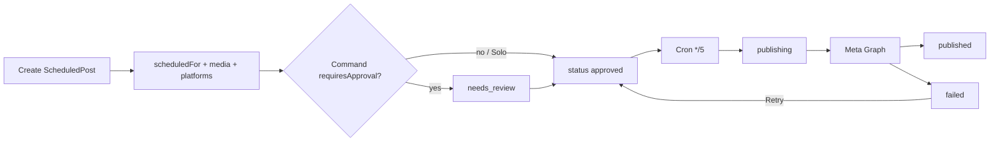
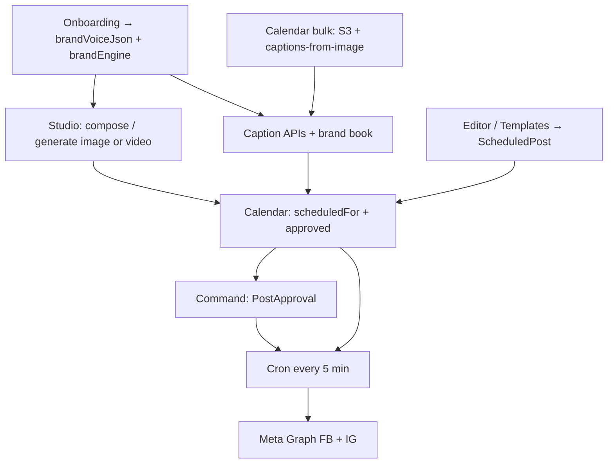

# Posterboy Social — Architecture

**Audience:** engineers and agents  
**Last updated:** 2026-07-21  
**Live:** https://www.posterboysocial.com  
**Repo:** `~/Code/thepostpal-readable-v2` (symlink: `~/Desktop/ventures/thepostpal`)

This is the canonical technical map of how onboarding, the dashboard, Studio, bulk upload, captions, editor, templates, AI, and publish work — what each surface operates on, and the stack underneath.

Related: [`AGENT-HANDOFF-2026-06-03.md`](./AGENT-HANDOFF-2026-06-03.md) · [`PROD-ENV-CHECKLIST.md`](./PROD-ENV-CHECKLIST.md) · [`MULTI_TENANT_RLS_IMPLEMENTATION.md`](./MULTI_TENANT_RLS_IMPLEMENTATION.md) · [`uploads-storage.md`](./uploads-storage.md)

---

## 1. Stack

| Layer | Technology |
|---|---|
| App | Next.js 16.2.6 (App Router, Turbopack), React 19, TypeScript, Tailwind CSS v4 |
| Hosting | Vercel project `angie-social-portal` (`bradly413s-projects`); `main` auto-deploys prod |
| Database | Neon Postgres + Prisma 6 + app-managed RLS (`app.current_tenant_id`) |
| Auth credentials | Upstash Redis / Vercel KV (scrypt password hashes) — separate from Prisma |
| Sessions | jose JWT in httpOnly cookie `session` (HS256, ~30 days) |
| Media | AWS S3 + public CDN via `S3_PUBLIC_BASE_URL` (CloudFront) |
| Social publish | Meta Graph API (Facebook + Instagram) |
| Billing | Stripe → `Organization.plan` via webhooks |
| AI text | Anthropic Claude (Sonnet / Haiku); optional Vercel AI Gateway |
| AI image | OpenAI GPT Image 2 primary; Google Gemini Nano Banana fallback and listing-photo path |
| AI video | Google Veo 3.1 (preview); Leonardo routes exist but Studio UI uses Veo |
| Ops | Sentry; Vercel cron; marketing analytics via Plausible/gtag/dataLayer |

**Local:** `npm run dev` → `http://127.0.0.1:8240`  
**Build:** `prisma generate && next build` (always generate after schema changes)

---

## 2. Tenancy and auth

### Two identity stores

1. **Credentials** — Redis (`auth:user:*`) via `src/lib/auth-store.ts`
2. **Tenant graph** — Postgres: `Organization` → `User` → `Location` → `LocationMembership`

Signup/login runs `ensureTenantProvisioned` (`src/lib/tenant-provisioning.ts`): org, user, primary location, membership, default `ApprovalRule`.

### Request path (every tenant API)

```
Cookie session
  → getSessionData()                 // src/lib/auth.ts
  → requireAuthContext()             // src/lib/api-auth.ts
  → withTenantDb(auth, fn)           // src/lib/db.ts — SET GUCs
  → resolveAccess(userId, locationId, tx)  // src/lib/authz.ts
  → Prisma under RLS
```

Also: `withProvisioningDb` (bootstrap), `withCronDb` (superadmin GUC for cron).

**Rule for new routes:** `requireAuthContext` → `withTenantDb` → `resolveAccess` → 403 on miss. Do not skip RLS.

### Solo vs Command

| Commercial | Prisma `PlanTier` | Behavior |
|---|---|---|
| Solo | `solo` (+ legacy single-location) | One location; no approval UI; composer ≈ schedule |
| Command | `house_account` (**no `command` enum**) | Multi-location, approvals, rollups; Meta Ads when flagged |

Source of truth: `src/lib/plan-features.ts`.  
Live UI plan: `GET /api/me` → `Organization.plan` (never trust JWT for plan).  
UI: `PlanProvider` / `usePlan()` in `src/app/dashboard/layout.tsx`.

---

## 3. Onboarding (Voice Architect)

| Route | Role |
|---|---|
| `/onboarding` | **Voice Architect** (canonical) — `VoiceArchitect.tsx` |
| `/onboarding/classic` | Escape hatch — older multi-step Brand Architect wizard |
| `POST /api/brand-book/generate` | Generate BrandBook JSON (guest or session) |
| `PUT /api/brand-book` | Persist book (auth required) |
| `PUT /api/brand-engine` | Org-level DNA (`niche`, `primaryTone`) |
| `POST /api/onboarding/analyze-history` | Infer voice from connected social history (classic path) |

### Interaction model

Warm-light immersive stage (`#f7f4ee`): one centered AI pill question at a time, then floating **Choose a Personality** tags. Collects a slim **voice profile** only — business name, what you do, where, personality, optional “never sound like.” No fonts, palettes, or dress-code steps.

**Optional social history (end of flow):** connect Facebook & Instagram → `POST /api/onboarding/analyze-history` pulls recent captions, media mix, posting cadence, and hashtags → merges into voice answers via `mergeHistoryIntoVoiceAnswers` before brand-book generate. Skip continues without history.

Helpers: `src/lib/voice-profile.ts`, `AiPillPrompt.tsx`, `PersonalityOrbit.tsx`.

### What gets written

| Persist call | Target |
|---|---|
| Provisioning | `Organization`, `User`, `Location`, `LocationMembership`, `ApprovalRule` |
| Brand engine | `Organization.brandEngine` (`niche`, `primaryTone`, `industryId`) |
| Brand book | `Location.brandVoiceJson` (voice + identity; generator may still fill unused visual defaults); upsert `BrandKit`, `BrandVoiceProfile` |

`brandVoiceJson` **voice + identity** fields are the primary signal for captions and chat. Generate alone does not persist — client must `PUT /api/brand-book` (or guest cache → sign-in).

Guest generate is allowed; DB save requires a session. Edge proxy allows unauthenticated `/onboarding` + generate only (`src/proxy.ts`).

---

## 4. Dashboard shell

```
dashboard/layout.tsx
  PlanProvider                 ← GET /api/me
  ActiveLocationProvider       ← GET /api/locations + localStorage active id
  DashboardShell               ← AppSidebar + warm-light frame
    page
```

| Piece | Path |
|---|---|
| Shell | `src/components/DashboardShell.tsx` |
| Sidebar | `src/components/dashboard/AppSidebar.tsx` |
| Plan | `src/components/dashboard/PlanProvider.tsx` |
| Location | `src/components/dashboard/ActiveLocationProvider.tsx` |
| API client | `src/lib/dashboard-api.ts` |
| States | `src/components/dashboard/StateViews.tsx` |

Location switcher shows only when Command + more than one location. Home and Studio self-frame; other pages use the shared shell.

**Design:** warm-light dashboard (`.pb-home2` / `.pb-app`). Serif is logo-only. No emojis in UI. See `CLAUDE.md` design system.

---

## 5. Content model and publish pipeline

**Canonical model:** `ScheduledPost` (not legacy `Draft` / `Post` for the live UI path).

### Status convention (do not violate)

| Status | Meaning |
|---|---|
| `draft` | Editable; not in cron queue |
| `needs_review` / `needs_revision` | Command approval pipeline |
| **`approved`** | **Internal cron publish queue** — only status cron dispatches |
| `publishing` | Cron claim in flight |
| `published` | Live |
| `failed` | `errorLog` + retry; `publishedPlatforms[]` prevents double-post |
| `scheduled` | Legacy Meta-native only — cron never dispatches; writes remap → `approved` |

### Flow



| Stage | Mechanism |
|---|---|
| Create / update | `GET/POST /api/posts`, `PUT /api/posts/[id]` |
| Approve (Command) | `submit-for-approval`, `approve`, `reject`, `request-changes`, `withdraw` — `src/lib/post-approval-service.ts` |
| Publish | Vercel cron → `GET /api/cron/publish` → `processDueScheduledPosts()` (`src/lib/cron-publish.ts`) |
| Immediate Meta | `POST /api/meta/publish` — Instagram has no true native schedule; product path is the queue |

**Schema migration rule:** apply prod migrations (`scripts/deploy-prod-db.sh`) **before** code that depends on them reaches `main`.

`CalendarEvent` is a separate business-events table — not social posts.

---

## 6. Creator Studio

**Route:** `/dashboard/studio` → `PosterboyStudio.tsx`  
**Client:** `use-studio-generation.ts`  
**Router:** `resolveStudioImageRoute()` in `src/lib/studio/studio-image-routing.ts`

### Image routes

| Route | When | Behavior |
|---|---|---|
| `blocked_listing_no_photo` | Listing brief, no reference | Client error; no model |
| `listing_passthrough` | Listing + reference | Crop/fit only — no Gemini |
| `reprompt_edit` | Canvas + edit delta | `POST /api/studio/reprompt` → generate |
| `compose_generate` | Vague “make a post…” | `POST /api/studio/compose` → generate |
| `direct_generate` | Concrete visual brief | Intent → `POST /api/generate-image` |

### Models and keys

| Capability | API | Model / provider |
|---|---|---|
| Image | `/api/generate-image` | GPT Image 2 (`OPENAI_API_KEY`) via `gpt-image.ts`; Gemini Nano Banana fallback/listings via `nano-banana.ts` |
| Compose / reprompt | `/api/studio/compose`, `/api/studio/reprompt` | Claude Sonnet (`ANTHROPIC_API_KEY`) |
| Video | `/api/generate-video` | Veo 3.1; poll client; materialize to S3 when configured |
| Scene logic | `scene-intent.ts`, vertical aesthetics | Shared classifiers + prompt suffixes |

Studio output lives in **client gen history** (data URLs) until the user saves/schedules.  
**Handoff to calendar:** `src/lib/studio/schedule-handoff.ts` (sessionStorage + `?from=studio`).

Leonardo API routes still exist; Studio UI does not call them (local canvas edits instead).

---

## 7. Bulk upload and auto captions

### Bulk (calendar)

`BulkScheduler.tsx` is **removed**. Bulk UX is inline on `/dashboard/calendar`:

1. Multi-file pick → `POST /api/upload/presigned` → S3 PUT (`dashboard-upload.ts`)
2. Optional `PhotoAsset` via photos API
3. Stagger schedule slots across the calendar (month-out friendly)
4. Optional serial auto-caption queue → `POST /api/ai/captions-from-image`
5. Create/update `ScheduledPost` rows (`approved` or Command submit)

Also: multipart `POST /api/upload` for smaller/local paths.

### Caption APIs

| Route | Input | Model |
|---|---|---|
| `POST /api/ai/captions` | Text brief, platform, count | Claude Sonnet via `getLanguageModel()` |
| `POST /api/ai/captions-from-image` | Image URL/inline + platform | Sonnet + vision |

Both use `buildTenantBrandContext()`: org, `brandEngine`, **location `brandVoiceJson`**, recent voice memory, edit patterns, compliance. No brand book → generic voice.

Studio caption picker: vision if source image exists, else text captions.

---

## 8. Editor and templates

| Surface | Role |
|---|---|
| `/dashboard/editor` | Caption + platforms → create/update `ScheduledPost` |
| `/dashboard/editor/[templateId]` | Template canvas → PNG export → upload → attach media |
| `/dashboard/templates` | Static catalog (`src/lib/templates` + `/api/templates/catalog`) |

Prisma `Template` exists for org-scoped JSON; primary UX is the static catalog + canvas exporter.

---

## 9. AI assistant and chat

| Surface | Route | Notes |
|---|---|---|
| Calendar assistant | `POST /api/ai/calendar-assistant` | NDJSON stream; tools list/delete scheduled posts for active location |
| General chat | `POST /api/ai` | Brand context + knowledge; Anthropic preferred, Gemini Flash fallback; **not** Gateway-routed |

### Model routing (`src/lib/ai/model.ts`)

```
if AI_GATEWAY_API_KEY or POSTERBOY_USE_AI_GATEWAY=true
  → anthropic/claude-sonnet-4.6 (Gateway)
else
  → @ai-sdk/anthropic + ANTHROPIC_API_KEY
```

Used by captions and calendar assistant. Compose/reprompt/elevate often use the Anthropic SDK directly.

---

## 10. Environment keys (what they operate on)

| Key | Operates on |
|---|---|
| `DATABASE_URL` | Prisma / Neon |
| `AUTH_SECRET` | JWT sessions |
| `KV_REST_API_*` / Upstash | Passwords, rate limits, OAuth state |
| `TOKEN_ENC_KEY` | Encrypted social tokens |
| `S3_*` / `S3_PUBLIC_BASE_URL` | Uploads, Veo materialization, media URLs |
| `ANTHROPIC_API_KEY` | Text AI, compose, reprompt, onboarding analysis |
| `AI_GATEWAY_API_KEY` / `POSTERBOY_USE_AI_GATEWAY` | Opt-in AI SDK Gateway |
| `GEMINI_API_KEY` | Studio images, Veo, some fallbacks |
| `LEONARDO_API_KEY` | Legacy Leonardo routes |
| `META_*` / `NEXT_PUBLIC_META_APP_ID` | OAuth + publish |
| `STRIPE_*` | Billing → plan |
| `CRON_SECRET` | Publish / token refresh crons |
| `SENTRY_*` | Monitoring |

Prod secrets are Brad-owned on Vercel — agents cannot `vercel env add` for production. Full list: [`PROD-ENV-CHECKLIST.md`](./PROD-ENV-CHECKLIST.md).

---

## 11. End-to-end: how a post is born



1. Onboarding stores voice + DNA on location/org.  
2. Studio, bulk, or editor produce media + copy.  
3. Everything converges on **`ScheduledPost`**.  
4. Solo → `approved`. Command may insert review.  
5. Cron claims due `approved` rows → Meta → `published` or `failed`.

---

## 12. Key file index

```
prisma/schema.prisma
src/lib/auth.ts
src/lib/api-auth.ts
src/lib/db.ts
src/lib/authz.ts
src/lib/tenant-provisioning.ts
src/lib/plan-features.ts
src/lib/dashboard-api.ts
src/lib/cron-publish.ts
src/lib/post-approval-service.ts
src/lib/brand-book-db.ts
src/lib/ai/model.ts
src/lib/studio/studio-image-routing.ts
src/lib/studio/gpt-image.ts
src/lib/studio/nano-banana.ts
src/lib/studio/veo.ts
src/lib/studio/schedule-handoff.ts
src/lib/storage.ts
src/lib/meta.ts

src/app/onboarding/page.tsx
src/components/onboarding/VoiceArchitect.tsx
src/lib/voice-profile.ts
src/components/onboarding/BrandArchitect.tsx  # classic escape hatch only
src/app/dashboard/layout.tsx
src/components/DashboardShell.tsx
src/components/dashboard/studio/PosterboyStudio.tsx
src/app/dashboard/calendar/page.tsx
src/app/api/posts/**
src/app/api/cron/publish/route.ts
src/app/api/generate-image/route.ts
src/app/api/generate-video/route.ts
src/app/api/ai/captions/route.ts
src/app/api/ai/captions-from-image/route.ts
src/app/api/ai/calendar-assistant/route.ts
src/app/api/studio/compose/route.ts
src/proxy.ts
```

---

## 13. One-line mental model

Posterboy is a **multi-tenant Next.js app** where a **voice profile on the Location** (from Voice Architect) steers **Claude**, **GPT Image 2** makes most Studio images with **Gemini** as fallback/listing specialist, the **calendar** owns **time + bulk**, and a **5-minute cron** is the only thing that publishes **`approved` `ScheduledPost`s** to **Meta** — with **Solo** skipping approval bureaucracy and **Command** (`house_account`) adding locations, reviewers, and rollups.
