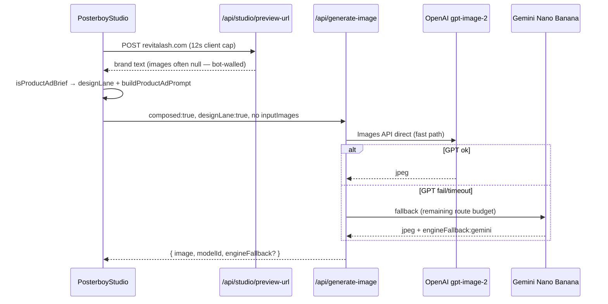

# Handoff — Studio GPT Image 2 + RevitaLash timeouts

**Date:** 2026-07-23  
**For:** OpenAI Codex / ChatGPT (or any agent picking up cold)  
**Repo:** `~/Code/thepostpal-readable-v2` (symlink `~/Desktop/ventures/thepostpal` — same checkout)  
**Branch:** `feat/gpt-image-2-primary` (tracks `origin/main`)  
**Prod:** https://www.posterboysocial.com  
**Local:** `export $(grep -h '^DATABASE_URL=' .env.local | sed 's/"//g') && npm run dev` → http://127.0.0.1:8240  
**Login:** `/sign-in` — `demo` / `demo123`

Read **`CLAUDE.md`** and **`docs/ARCHITECTURE.md`** first. This doc supersedes them only for Studio image-generation work.

---

## One-line reality

Posterboy **Creator Studio** (`/dashboard/studio`) routes most generation through **OpenAI GPT Image 2** (Responses API + Images API), with **Gemini (Nano Banana) as fallback**. Product-ad prompts with a website URL (e.g. RevitaLash) produce designed social ads — not beauty portraits. Commit `0ae2238` shipped the first timeout pass; the follow-up in this document enforces one end-to-end provider budget and scopes the client watchdog to the active image request.

---

## What Brad reported (this session arc)

| Symptom | Likely cause (fixed or WIP) |
|--------|-----------------------------|
| OpenAI direct chat made a perfect RevitaLash ad; Studio made a nonsense before/after lash portrait | Site-grounded prompts skipped Director → never got `designLane`; server still ran `expandImageBrief` (portrait rewrite); appended `REAL_PHOTO_GENERATION_SUFFIX` |
| Network error on generate | `engine: "gpt"` disabled Gemini fallback; long GPT retry chain exceeded Vercel 120s |
| UI stuck on **Generating…** forever | No client watchdog; `composeInFlightRef` stuck when fetch hung |
| **Timed out. Please try again.** (latest screenshot) | GPT ate ~90s (2×45s Responses), Gemini fallback needed ~85s more, client aborted at 120s |

**Repro prompt (Instagram 4:5, High quality):**

> Create an image for our new eyelash serum. use revitalash.com for images and information.

---

## What's on `main` (deployed unless Brad hasn't redeployed)

| Commit | Summary |
|--------|---------|
| `3c331c0` | GPT Image 2 primary via Responses API |
| `56e84df` | Multimodal vision inputs, product-ad routing, GPT edit path |
| `5fbd2de` | Restore Gemini fallback; stop sending `engine:gpt` for design lane; orchestrator retries; parallel preview-url fallbacks |
| `0ae2238` | Direct Images API product-ad path, Gemini remaining-budget fallback, client abort/watchdog recovery |

---

## Shipped implementation

The original six-file WIP shipped in `0ae2238`. A review follow-up tightens the same behavior:

| File | Change |
|------|--------|
| `src/lib/studio/gpt-image.ts` | Direct Images API fast path; default `gpt-4.1-mini`; every sequential GPT hop shares the route deadline and fallback reserve |
| `src/app/api/generate-image/route.ts` | Deadline starts at request entry; Gemini gets only the actual remaining budget |
| `src/lib/studio/nano-banana.ts` | Optional `timeoutMs` for fallback |
| `src/lib/studio/scene-intent.ts` | `buildProductAdPrompt(..., { hasReferenceImages })` when site fetch fails |
| `src/components/dashboard/studio/hooks/use-studio-generation.ts` | 315s fetch abort plus tracked request IDs, cancellation, stale-result invalidation, and reason-specific fallback notice |
| `src/components/dashboard/studio/PosterboyStudio.tsx` | 325s watchdog starts at the image request only; Director and Veo are excluded |

---

## RevitaLash flow

---

## Architecture — Studio image generation

### Client flow

1. User submits prompt → `runComposeFromIntent` in `PosterboyStudio.tsx`
2. If URL in prompt → `resolveWebsiteBrand` → `POST /api/studio/preview-url` (12s timeout)
3. `composeFromIntent` in `use-studio-generation.ts`:
   - **Site grounded:** skip Director (saves ~35s Claude hop)
   - **Product ad:** `isProductAdBrief()` → `designLane: true`, `buildProductAdPrompt()`
   - `POST /api/generate-image` with `composed: true`, `designLane: true`
4. Success → chat bubble + `ParticleReveal`; failure → error strip + assistant bubble error

### Server flow (`/api/generate-image`)

- `maxDuration = 300`
- **Listing photos:** Gemini only (never GPT edit for listings)
- **Design lane:** GPT with `forceImageTool`, `GPT_DESIGN_SUFFIX` (typography allowed)
- **Gemini fallback:** when GPT fails and `engine !== "gpt"` (never send `engine:gpt` from design lane)
- **Art director expand:** skipped when `composed: true`

### Key libs

| Path | Role |
|------|------|
| `src/lib/studio/gpt-image.ts` | GPT Image 2 — Responses + Images API |
| `src/lib/studio/openai-vision-input.ts` | Multimodal `input_image` parts |
| `src/lib/studio/scene-intent.ts` | `isProductAdBrief`, `buildProductAdPrompt`, listing detection |
| `src/lib/studio/nano-banana.ts` | Gemini Interactions fallback |
| `src/lib/studio/studio-image-routing.ts` | Client route: compose / reprompt / listing / blocked |
| `src/app/api/studio/preview-url/route.ts` | Site OG + search grounding (`maxDuration 60`) |
| `src/app/api/studio/director/route.ts` | Claude classify + art-direct (skipped when site-grounded) |

### Time budgets

| Stage | Budget |
|-------|--------|
| preview-url (client) | 12s |
| Director (if used) | 35s client abort |
| GPT direct Images API | Standard up to 125s; High up to 190s, bounded by route deadline minus fallback reserve |
| GPT Responses (fallback) | up to 1 attempt, bounded by the same remaining budget |
| Gemini fallback | min(85s, route deadline remaining), with 90s reserved before GPT starts |
| Client `/api/generate-image` abort | 315s (outlives the 300s function for response transfer/parsing) |
| Client watchdog | 325s from image-request start; aborts and invalidates that request only |

---

## Product rules — do NOT undo

Brad was explicit: **no user-facing engine picker**, no “Brand Kit” or “Brand locked” UI.

- Director auto-routes; brand grounding always on server-side
- `engine`, `designLane`, `brandLock` are **API-only** params
- `imageEngine === "design"` in the hook sends `engine: "gpt"` — **bake-off only**; disables Gemini. Never wire that to normal UI.
- Listing photos stay on **Gemini**, not GPT edit

---

## Environment

Per `CLAUDE.md` (2026-07-13): prod has `OPENAI_API_KEY`, `GEMINI_API_KEY`, and core env set.

Optional:

- `OPENAI_RESPONSES_MODEL` — orchestrator override for Responses API. Default chain: env override → `gpt-4.1-mini` → `gpt-4.1` → `gpt-5.6`.

Local `.env.local` often lacks `OPENAI_API_KEY` → local Studio uses Gemini only.

---

## Verification

Recorded against production `0ae2238` on 2026-07-23 CT:

- `POST /api/studio/preview-url` returned 200.
- `POST /api/generate-image` returned 200.
- High-quality 4:5 RevitaLash generated a designed product ad through the honest Gemini fallback; the UI showed `GPT Image 2 couldn't finish — generated with Posterboy Visual instead.`
- The UI recovered before its request abort and did not stick on **Generating…**.
- Browser console and Next.js overlay checks were clean.
- `./scripts/smoke-prod.sh`: 12 passed, 0 failed.
- `npm test -- --run`: 264 passed before the follow-up tests were added.

Repeat after any provider-budget change:

1. Prod: `/dashboard/studio` → same RevitaLash prompt, Instagram 4:5.
2. **Network/runtime logs:**
   - `POST /api/studio/preview-url` — 200 or soft-fail; note `imageUrls[]` (often empty for RevitaLash)
   - `POST /api/generate-image` — should complete inside the 300s server window with `modelId` containing `gpt-image` **or** `engineFallback: "gemini"`
3. UI must not stay on Generating; the image-only watchdog must not affect Director or Veo.
4. If GPT still times out on **High**, confirm the honest Gemini fallback; compare **Standard** separately.
5. Run `./scripts/smoke-prod.sh` and `npm test -- --run`.

---

## Open follow-ups (P2+)

- [ ] Wire `analyzeImageViaResponses` into reprompt when reference attached
- [ ] Inpainting / masks — not implemented
- [ ] When `revitalash.com` is bot-walled, consider curated product image URLs or Shopify JSON fallback (preview-url already tries parallel fallbacks)
- [ ] Replace or retire the stale body of `docs/CODEX-HANDOFF.md` (its top warning now points here)

---

## Gotchas

1. **Cursor + Claude Code share this working tree** — check `git branch --show-current` before committing; commit early.
2. **`prisma generate`** required after schema changes; build is `prisma generate && next build`.
3. **Agents cannot `vercel env add` for production** — Brad sets prod env.
4. **`gh pr create` fails** (CLI authed as wrong user) — use browser PR or `git push` to `main`.
5. **Publish pipeline statuses:** `approved` = internal cron queue; never write new posts as `scheduled` for cron.
6. **Do not use retired dark/gold UI** — dashboard is warm-light (see `CLAUDE.md` design system).

---

## Related docs

| Doc | Purpose |
|-----|---------|
| `CLAUDE.md` | Canonical agent rules + Studio overview |
| `docs/ARCHITECTURE.md` | System map |
| `docs/PROD-ENV-CHECKLIST.md` | Prod env |
| `docs/BETA-TESTER-INSTRUCTIONS.md` | Beta flow |
| `docs/CODEX-HANDOFF.md` | Older Codex handoff (mostly stale — use this doc for Studio) |

---

## One paragraph for ChatGPT

GPT Image 2 is Studio's primary generator, with Gemini as an honest fallback. Commit `0ae2238` shipped the direct Images API product-ad path and succeeded on the RevitaLash production repro via fallback. The follow-up hardening makes all provider calls share one deadline, gives Standard up to 125s and High up to 190s while preserving Gemini headroom, defaults the Responses orchestrator to `gpt-4.1-mini`, and ties the 325s watchdog to a cancellable image request ID so late results cannot overwrite a newer turn and Veo is unaffected. Re-run the production repro, smoke suite, and tests after deploying any further timing change.
