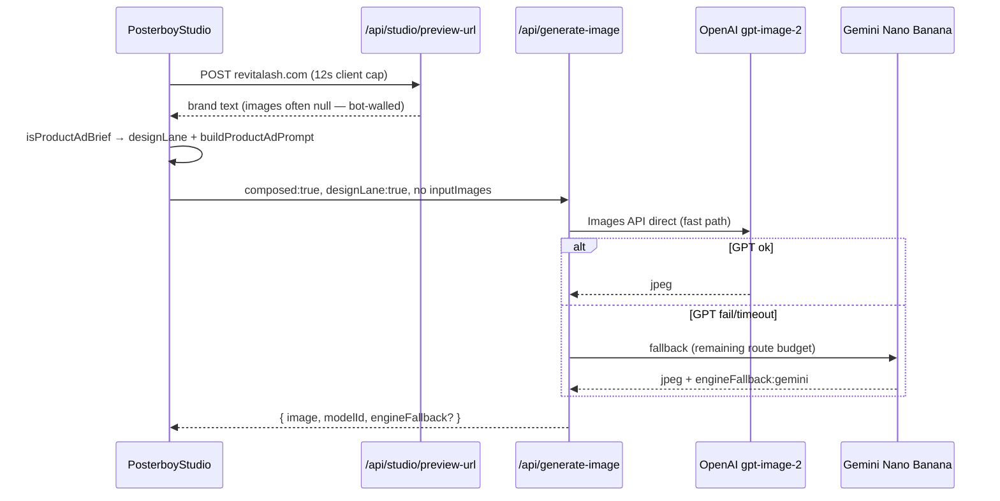

# Handoff — Studio GPT Image 2 + RevitaLash timeouts

**Date:** 2026-07-23  
**For:** OpenAI Codex / ChatGPT (or any agent picking up cold)  
**Repo:** `~/Code/thepostpal-readable-v2` (symlink `~/Desktop/ventures/thepostpal` — same checkout)  
**Branch:** `feat/gpt-image-2-primary` (tracks `origin/main`)  
**Prod:** https://www.posterboysocial.com  
**Local:** `export $(grep -h '^DATABASE_URL=' .env.local | sed 's/"//g') && npm run dev` → http://127.0.0.1:8240  
**Login:** `/sign-in` — `demo` / `demo123`

Read **`CLAUDE.md`** and **`docs/ARCHITECTURE.md`** first. This doc supersedes them only for Studio image-generation work.

---

## One-line reality

Posterboy **Creator Studio** (`/dashboard/studio`) now routes most generation through **OpenAI GPT Image 2** (Responses API + Images API), with **Gemini (Nano Banana) as fallback**. Product-ad prompts with a website URL (e.g. RevitaLash) should produce designed social ads — not beauty portraits. As of this handoff, **prod still times out** on that prompt unless the **uncommitted WIP** below is committed and deployed.

---

## What Brad reported (this session arc)

| Symptom | Likely cause (fixed or WIP) |
|--------|-----------------------------|
| OpenAI direct chat made a perfect RevitaLash ad; Studio made a nonsense before/after lash portrait | Site-grounded prompts skipped Director → never got `designLane`; server still ran `expandImageBrief` (portrait rewrite); appended `REAL_PHOTO_GENERATION_SUFFIX` |
| Network error on generate | `engine: "gpt"` disabled Gemini fallback; long GPT retry chain exceeded Vercel 120s |
| UI stuck on **Generating…** forever | No client watchdog; `composeInFlightRef` stuck when fetch hung |
| **Timed out. Please try again.** (latest screenshot) | GPT ate ~90s (2×45s Responses), Gemini fallback needed ~85s more, client aborted at 120s |

**Repro prompt (Instagram 4:5, High quality):**

> Create an image for our new eyelash serum. use revitalash.com for images and information.

---

## What's on `main` (deployed unless Brad hasn't redeployed)

| Commit | Summary |
|--------|---------|
| `3c331c0` | GPT Image 2 primary via Responses API |
| `56e84df` | Multimodal vision inputs, product-ad routing, GPT edit path |
| `5fbd2de` | Restore Gemini fallback; stop sending `engine:gpt` for design lane; orchestrator retries; parallel preview-url fallbacks |

---

## Uncommitted WIP (must commit + push + deploy)

**6 files, ~126 insertions** — not on prod yet:

| File | Change |
|------|--------|
| `src/lib/studio/gpt-image.ts` | Direct Images API fast path for product ads; cap Responses retries; 55s per-call timeout; default orchestrator `gpt-4.1-mini` |
| `src/app/api/generate-image/route.ts` | `preferDirectImagesApi` for design lane; route deadline + Gemini gets **remaining** budget |
| `src/lib/studio/nano-banana.ts` | Optional `timeoutMs` for fallback |
| `src/lib/studio/scene-intent.ts` | `buildProductAdPrompt(..., { hasReferenceImages })` when site fetch fails |
| `src/components/dashboard/studio/hooks/use-studio-generation.ts` | Client gen timeout **130s**; removed blocking early return; better timeout copy |
| `src/components/dashboard/studio/PosterboyStudio.tsx` | **135s watchdog**; try/catch on compose; stuck-turn recovery |

**Suggested commit message:**

```
fix(studio): finish product-ad generates within Vercel budget

Use direct GPT Image 2 for design-lane product ads, reserve time for
Gemini fallback, and add client watchdog so UI never sticks on Generating.
```

---

## Intended RevitaLash flow (after WIP deploy)



---

## Architecture — Studio image generation

### Client flow

1. User submits prompt → `runComposeFromIntent` in `PosterboyStudio.tsx`
2. If URL in prompt → `resolveWebsiteBrand` → `POST /api/studio/preview-url` (12s timeout)
3. `composeFromIntent` in `use-studio-generation.ts`:
   - **Site grounded:** skip Director (saves ~35s Claude hop)
   - **Product ad:** `isProductAdBrief()` → `designLane: true`, `buildProductAdPrompt()`
   - `POST /api/generate-image` with `composed: true`, `designLane: true`
4. Success → chat bubble + `ParticleReveal`; failure → error strip + assistant bubble error

### Server flow (`/api/generate-image`)

- `maxDuration = 120`
- **Listing photos:** Gemini only (never GPT edit for listings)
- **Design lane:** GPT with `forceImageTool`, `GPT_DESIGN_SUFFIX` (typography allowed)
- **Gemini fallback:** when GPT fails and `engine !== "gpt"` (never send `engine:gpt` from design lane)
- **Art director expand:** skipped when `composed: true`

### Key libs

| Path | Role |
|------|------|
| `src/lib/studio/gpt-image.ts` | GPT Image 2 — Responses + Images API |
| `src/lib/studio/openai-vision-input.ts` | Multimodal `input_image` parts |
| `src/lib/studio/scene-intent.ts` | `isProductAdBrief`, `buildProductAdPrompt`, listing detection |
| `src/lib/studio/nano-banana.ts` | Gemini Interactions fallback |
| `src/lib/studio/studio-image-routing.ts` | Client route: compose / reprompt / listing / blocked |
| `src/app/api/studio/preview-url/route.ts` | Site OG + search grounding (`maxDuration 60`) |
| `src/app/api/studio/director/route.ts` | Claude classify + art-direct (skipped when site-grounded) |

### Time budgets (after WIP)

| Stage | Budget |
|-------|--------|
| preview-url (client) | 12s |
| Director (if used) | 35s client abort |
| GPT direct Images API | 55s |
| GPT Responses (fallback) | 1 attempt × 55s |
| Gemini fallback | min(85s, route deadline remaining) |
| Client `/api/generate-image` abort | 130s |
| Client watchdog | 135s |

---

## Product rules — do NOT undo

Brad was explicit: **no user-facing engine picker**, no “Brand Kit” or “Brand locked” UI.

- Director auto-routes; brand grounding always on server-side
- `engine`, `designLane`, `brandLock` are **API-only** params
- `imageEngine === "design"` in the hook sends `engine: "gpt"` — **bake-off only**; disables Gemini. Never wire that to normal UI.
- Listing photos stay on **Gemini**, not GPT edit

---

## Environment

Per `CLAUDE.md` (2026-07-13): prod has `OPENAI_API_KEY`, `GEMINI_API_KEY`, and core env set.

Optional:

- `OPENAI_RESPONSES_MODEL` — orchestrator for Responses API (default chain: env → `gpt-5.6` → `gpt-4.1-mini` → `gpt-4.1`). WIP defaults to **`gpt-4.1-mini`** if unset.

Local `.env.local` often lacks `OPENAI_API_KEY` → local Studio uses Gemini only.

---

## Verification checklist (post-deploy)

1. **Commit and push** the 6 WIP files; `main` auto-deploys Vercel `angie-social-portal`.
2. Prod: `/dashboard/studio` → same RevitaLash prompt, Instagram 4:5.
3. **Network tab:**
   - `POST /api/studio/preview-url` — 200 or soft-fail; note `imageUrls[]` (often empty for RevitaLash)
   - `POST /api/generate-image` — should complete in &lt;130s with `modelId` containing `gpt-image` **or** `engineFallback: "gemini"`
4. UI must **not** stay on Generating past ~2 min — watchdog should show error instead.
5. If still timing out on **High**: try **Standard** (Pro/High GPT is slower).
6. Run `./scripts/smoke-prod.sh` (unchanged by this work).
7. Run `npm test -- --run` — **264 tests** should pass.

---

## Open follow-ups (P2+)

- [ ] Wire `analyzeImageViaResponses` into reprompt when reference attached
- [ ] Inpainting / masks — not implemented
- [ ] When `revitalash.com` is bot-walled, consider curated product image URLs or Shopify JSON fallback (preview-url already tries parallel fallbacks)
- [ ] Set `OPENAI_RESPONSES_MODEL=gpt-4.1-mini` on prod if `gpt-5.6` unavailable/slow
- [ ] Update stale `docs/CODEX-HANDOFF.md` (still says localStorage-only dashboard)

---

## Gotchas

1. **Cursor + Claude Code share this working tree** — check `git branch --show-current` before committing; commit early.
2. **`prisma generate`** required after schema changes; build is `prisma generate && next build`.
3. **Agents cannot `vercel env add` for production** — Brad sets prod env.
4. **`gh pr create` fails** (CLI authed as wrong user) — use browser PR or `git push` to `main`.
5. **Publish pipeline statuses:** `approved` = internal cron queue; never write new posts as `scheduled` for cron.
6. **Do not use retired dark/gold UI** — dashboard is warm-light (see `CLAUDE.md` design system).

---

## Related docs

| Doc | Purpose |
|-----|---------|
| `CLAUDE.md` | Canonical agent rules + Studio overview |
| `docs/ARCHITECTURE.md` | System map |
| `docs/PROD-ENV-CHECKLIST.md` | Prod env |
| `docs/BETA-TESTER-INSTRUCTIONS.md` | Beta flow |
| `docs/CODEX-HANDOFF.md` | Older Codex handoff (mostly stale — use this doc for Studio) |

---

## One paragraph for ChatGPT

Brad is shipping **GPT Image 2 as Studio's primary generator** so product-ad prompts (e.g. RevitaLash + website URL) match what he gets from OpenAI directly. `main` has multimodal + Gemini fallback, but **timeouts persist** because GPT Responses retries consumed the full Vercel 120s before Gemini could run, and the client aborted at 120s. **Uncommitted WIP** adds a direct Images API fast path for design-lane product ads, caps GPT attempts, gives Gemini the remaining server budget, raises client timeout to 130s, and adds a UI watchdog. **Next agent:** commit/push/deploy that WIP, repro the RevitaLash prompt on prod, confirm `/api/generate-image` returns an image or honest Gemini fallback — not infinite Generating or timeout.
